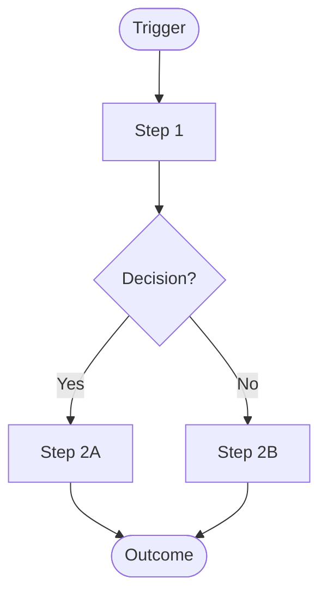

# Process Scenario Prototype: <Name>

## Decision
What decision will this process prototype inform?

## Assumption
What workflow, handoff, state, or boundary assumption is being tested?

## Audience / Context
Who will review or run through this process, and in what context?

## Scope
What part of the process is included?

## Omitted
What implementation details, edge cases, systems, or policies are intentionally excluded?

## Actors and Systems
| Name | Type | Responsibility |
|------|------|----------------|
|  | Actor/System |  |

## Inputs and Outputs
- Inputs:
- Outputs:
- Required data/state:

## Mermaid Diagram

## Run-Through Scenario: Happy Path
- Starting condition:
- Trigger:
- Steps:
  1. 
  2. 
  3. 
- Expected outcome:
- Evidence to observe:

## Run-Through Scenario: Stress / Edge Path
- Starting condition:
- Trigger or complication:
- Steps:
  1. 
  2. 
  3. 
- Expected outcome:
- Evidence to observe:

## Open Questions
- 

## Validation Signals
- 

## Failure Signals
- 

## Next Decision
What will be decided after reviewing or running through the scenarios?
