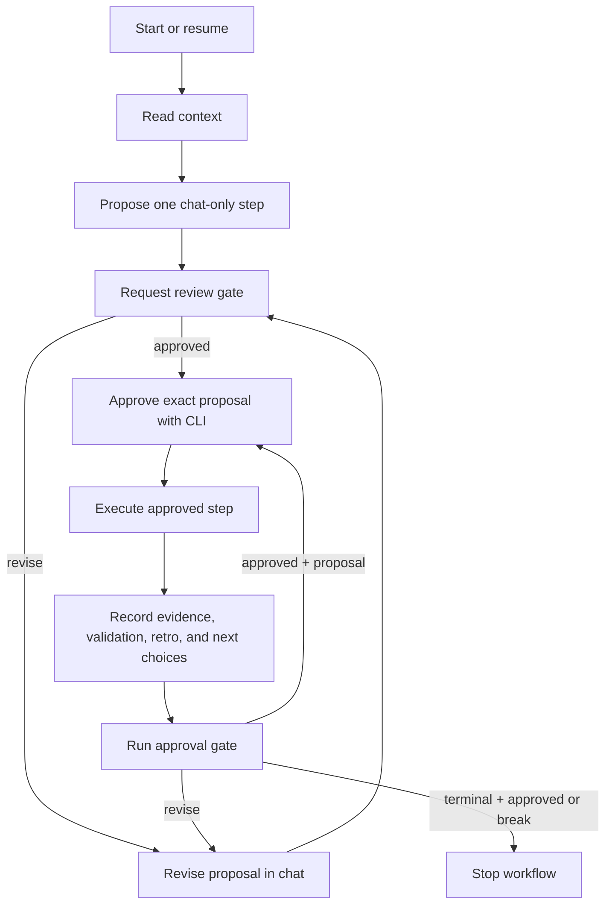

# step

Goal: Orchestrate local next-best-step progress through `scripts/step_cli.py`: start a STEP workflow, promote an approved step, execute it, record its result, and gate the next step for user review.
Non-Goals: Do not modify a STEP state file manually, bypass the CLI, execute an unapproved proposal, or manage broad task state.
Use-When: You have a goal and want repeated local progress recorded with explicit user approval at each step boundary.

## 1. Protocol

The CLI is authoritative for STEP state. Proposals exist in chat only. The required cycle is:



Only the whole user message `approved` promotes the currently displayed chat proposal. After it, `approve` is the first state-changing action and must succeed before execution. `break` is terminal only: accept it only after `gate` succeeds and the current step has `next_steps: []` and `recommendation: null`; it changes no state. Any other response is a revision request.

## 2. Mandatory Phase References

Read the reference for the active phase **before performing work in that phase**:

| Phase | Mandatory reference | Read when |
| --- | --- | --- |
| Start | [`references/start.md`](references/start.md) | Initializing or resuming a workflow, proposing its first step, or handling its first approval. |
| Execute | [`references/execute.md`](references/execute.md) | Working on an approved current step, recording its outcome, or preparing its next choices. |
| Gate | [`references/gate.md`](references/gate.md) | Presenting a gate, handling approval, revision, criteria changes, terminal completion, or `break`. |

## 3. Examples

Proposed packets remain chat-only until a successful `approve` command.

### Golden Path

**Prompt:** `/skill:step Goal: Refactor step skill. Lesson: PLAN-refactor-step.md has the plan.`

```bash
python scripts/step_cli.py --file STEP-refactor-step.yaml start \
  --goal "Refactor step skill" \
  --lesson "PLAN-refactor-step.md has the plan."
python scripts/step_cli.py --file STEP-refactor-step.yaml context

# Show a chat-only define-cli-protocol-commands proposal. After exactly `approved`:
python scripts/step_cli.py --file STEP-refactor-step.yaml approve \
  --slug define-cli-protocol-commands \
  --intent "Define CLI protocol commands for step" \
  --criteria "CLI exposes start, context, approve, record, gate, and lint commands"

# Do the approved work, then record and gate it:
python scripts/step_cli.py --file STEP-refactor-step.yaml record \
  --do '{summary: "Defined the step CLI protocol command surface", evidence: ["scripts/step_cli.py"]}' \
  --validate '{result: success, evidence: ["CLI help shows the protocol workflow"]}' \
  --retro '{wins: ["Protocol command names match the goal"], issues: [], actions: []}' \
  --next-steps '[simplify-step-docs]' \
  --recommendation simplify-step-docs
python scripts/step_cli.py --file STEP-refactor-step.yaml gate
```

The agent outputs the gate YAML and separately proposes `simplify-step-docs`; exact `approved` promotes it before its execution.

### Update goal

To replace a workflow's goal without discarding its lessons or recorded steps, restart it with `--force`:

```bash
python scripts/step_cli.py --file STEP-refactor-step.yaml start \
  --goal "Refactor and simplify the step skill" \
  --force
```

### Terminal break

After completing a final approved step, record an explicitly terminal outcome and gate it:

```bash
python scripts/step_cli.py --file STEP-refactor-step.yaml record \
  --do '{summary: "Finished the final documentation update", evidence: ["src/map/step/SKILL.md"]}' \
  --validate '{result: success, evidence: ["All required references exist"]}' \
  --retro '{wins: ["Protocol is complete"], issues: [], actions: []}' \
  --next-steps '[]' \
  --recommendation null
python scripts/step_cli.py --file STEP-refactor-step.yaml gate
```

Present the successful gate YAML and final sign-off. Only now, when the current step shows `next_steps: []` and `recommendation: null`, the exact user response `break` stops the workflow. It does not write state.

### Revision of a proposed next step

A successful gate selects `simplify-step-docs`, which is shown as a chat-only proposal. The user replies with anything other than exactly `approved`, for example: “Use `add-phase-references` instead and include mandatory-read wording.”

Do not call `approve` or execute work. Revise the [proposed packet](assets/proposed_next_template.md) in chat, request review again, and run `gate` again to present fresh gate context:

```yaml
proposed:
  slug: add-phase-references
  intent: Move phase procedures into mandatory references
  criteria:
    - Each active phase names a required reference file
```

After exact `approved`, use that exact packet with `approve`. The slug must be in the prior current step's `next_steps`.

### Failed approval

Suppose the current step's `next_steps` contains only `simplify-step-docs`, but the displayed proposal mistakenly uses `add-phase-references`. Even after exact `approved`, the CLI must reject it:

```bash
python scripts/step_cli.py --file STEP-refactor-step.yaml approve \
  --slug add-phase-references \
  --intent "Move phase procedures into mandatory references" \
  --criteria "Each active phase names a required reference file"
```

Report the error. Do not execute the rejected proposal. Revise the chat-only proposal to an eligible, unique slug, request review again, and rerun `gate` before a new approval attempt.

### Blocked or partial execution

When an approved step is blocked or only partially succeeds, record the result and one recovery or investigation choice, then gate it:

```bash
python scripts/step_cli.py --file STEP-refactor-step.yaml record \
  --do '{summary: "Moved the start procedure but could not validate reference links", evidence: ["src/map/step/references/start.md"]}' \
  --validate '{result: partial, evidence: ["Link checker is unavailable"]}' \
  --retro '{wins: ["Start procedure extracted"], issues: ["Cannot run link validation"], actions: ["Investigate the documentation checker"]}' \
  --next-steps '[investigate-doc-links]' \
  --recommendation investigate-doc-links
python scripts/step_cli.py --file STEP-refactor-step.yaml gate
```

Output the successful gate YAML and separately propose `investigate-doc-links` in chat. It still requires exact `approved` and successful `approve` before any recovery work begins.
